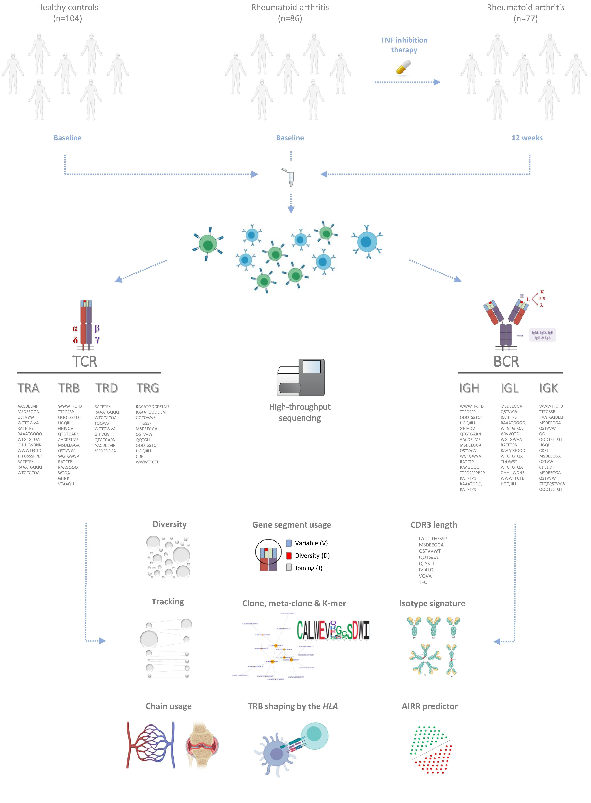

# Seven chain adaptive immune receptor repertoire analysis in rheumatoid arthritis: association to disease and clinically relevant phenotypes

## Abstract

Rheumatoid arthritis (RA) is an immune-mediated inflammatory disease characterized by a defective adaptive immune receptor repertoire (AIRR) that fails to distinguish self from non-self antigens. The AIRR is vast, encompassing four T cell receptor (TCR) and three B cell receptor (BCR) chains, each of which displays an extraordinary amino acid sequence variability in the antigen-binding site. How the concerted action of T and B cell clones is associated with the development and clinical evolution of immune-mediated diseases is still not known. Using a new immunosequencing technology that allows the unbiased amplification of the seven receptor chains, we conducted an in-depth quantitative analysis of the seven-receptor chain variability in RA. Compared to healthy controls, the AIRR in RA was found to be characterized by a lower BCR diversity, the depletion of highly similar BCR clones, an isotype-specific signature as well as a skewed IGL chain and gene segment usage. A predictor based on quantitative multi-chain AIRR information was able to accurately predict disease, including the elusive seronegative subset of RA patients. AIRR features of the seven immune receptor chains were also different between patients with distinct clinically relevant phenotypes. Incorporating HLA variation data, we were able to identify the TCR clones that are specifically associated with the main disease risk variants. The longitudinal analysis of the AIRR revealed that treatment with Tumor Necrosis Factor (TNF) inhibitors selectively restores the diversity of B cell clones in RA patients by reducing the frequency of clones with a similar biochemical profile. The biochemical properties of the TNFi-modulated clones were also found to differ between responders and non-responders, supporting a different antigenic reactivity in the B cell compartment of these two groups of RA patients. Our comprehensive analysis of the TCR and BCR repertoire reveals a complex T and B cell architecture in RA, and provides the basis for precision medicine strategies based on the highly informative features of the adaptive immune response.

## Overview of the study

## Link to the paper

The manuscript "Seven chain adaptive immune receptor repertoire analysis in rheumatoid arthritis: association to disease and clinically relevant phenotypes" can be found here [XXX](XXXX)

## Important Links

Raw immunosequencing data from the seven receptor chains are available for downloading at the website of the Rheumatology Research Group (www.urr.cat/airr_ra).

Summary statistics for the main AIRR measures are available for downloading at the website of the Rheumatology Research Group (www.urr.cat/airr_ra).

## Files and folders

The main directory contains the R scripts and three diferent folders that conain: i) raw data (i.e. Input_Data/), processed data to be analyzed by the scripts (i.e. Data2analyze/) and the generated outputs from the R scripts (i.e. Output_Data/). The R scripts included in the main directory allow to perform the AIRR analyses described in the manuscript. In order to execute the R scripts, the working directory should be set to source file location in RStudio: 1) Click on the Session tab, and 2) Click on Set Working Directory > To Source File Location. Afterwards, your working directory will be changed to the location of your source file.

* [`Input_Data`](Input_Data/) folder. Raw AIRR-seq data from the seven receptor chains available at the website of the Rheumatology Research Group must be saved in this folder. Raw AIRR-seq data from four samples are provided as a toy dataset.
* [`Data2analyze`](Data2analyze/) folder contains the preprocessed AIRR-seq data and AIRR measures to be used for the AIRR analyses. This folder also contains the scripts used to estimate the isotype features: the main script containing the exact migec + mixcr commands that were run is called run-hybrid-per.sh, and the other python scripts are supplementary scripts used within this main script.

* [`Output_Data`](Output_Data/) folder contains the results obtained in the AIRR analyses that are described in the manuscript.

* [`Metadata`](Data2analyze/Metadata.csv) file contains the main clinical and epidemiological features of each sample.
* [`LongitudinalInfo`](Data2analyze/Donor2RNA_Codes.txt) file contains the name of the samples at baseline and after 12 weeks of TNFi therapy.
* [`Metadata`](Data2analyze/Metadata.csv) file contains the main clinical and epidemiological features of each sample.
* [`TechnicalVar`](Data2analyze/TechnicalVar.txt) file contains the plate number as well as the RNA integrity and concentration values for each sample.
* [`CloneDet`](Data2analyze/CloneDet.rds) file provides the number of clones and reads both at the sample and chain levels.
* [`DivBaselineControls`](Data2analyze/DivBaselineControls.rds) file contains the diversity measures both at the sample and chain levels at baseline.
* [`DivWeek12Controls`](Data2analyze/ivWeek12Controls.rds) file contains the diversity measures after 12 weeks of TNFi therapy both at the sample and chain levels.
* [`DivStatistics`](Data2analyze/DivStatistics.rds) file contains the diversity measures for all samples included in the analysis.
* [`CloneDet`](Data2analyze/CloneDet.rds) file provides the number of clones and reads both at the sample and chain levels.
* [`ChainReadsCount`](Data2analyze/ChainReadsCount.rds) file contains the total of reads per chain for each sample at baseline
* [`ChainReadsCountWeek12`](Data2analyze/ChainReadsCountWeek12.rds) file contains the total of reads per chain for each sample after 12 weeks of TNF inhibition therapy.
* [`ChainReadsProp`](Data2analyze/ChainReadsProp.rds) file contains the proportion of reads per chain for each sample at baseline.
* [`ChainReadsPropWeek12`](Data2analyze/ChainReadsPropWeek12.rds) file contains the proportion of reads per chain for each sample after 12 weeks of TNF inhibition therapy.
* [`IsotypePerc`](Data2analyze/IsotypePerc.rds) file contains the isotype percentage at the sample level.
* [`IgDMmutPerc`](Data2analyze/IgDMmutPerc.rds) file contains the percentage of mutated IgD/M per sample.
* [`CSRindex`](Data2analyze/CSRindex.rds) file contains the isotype class switching index per sample.
* [`SHM`](Data2analyze/SHM.rds) file contains the degree of somatic hypermutations detected in each sample.
* [`ReadsMJLewis.rds`](Data2analyze/ReadsMJLewis.rds) file contains the number of chain reads detected after estimating the the AIRR from the bulk RNA-Seq dataset generated by Lewis MJ et al '19 using MiXCR software.
* [`GeneUsageV`](Data2analyze/GeneUsageV.rds) file contains the frequency of each V gene segment at the sample level.
* [`GeneUsageJ`](Data2analyze/GeneUsageJ.rds) file contains the frequency of each J gene segment at the sample level.
* [`GeneUsageVJ`](Data2analyze/GeneUsageVJ.rds) file contains the frequency of each VJ gene segment pair at the sample level.
* [`GeneUsageVJ`](Data2analyze/CloneProp.rds) file contains the frequency of each clone both at the sample and chain levels.
* [`GenoHLA`](Data2analyze/GenoHLA.rds) files contains the HLA genotype information for each sample.
* [`SummaryAIRR.rds`](Data2analyze/SummaryAIRR.rds.rds) file provides the value of each AIRR measure both at the sample and chain levels.

* [`DataPreprocessing`](DataPreprocessing.R) script executes the processing from raw AIRR-seq data to the data used for the AIRR analyses. The output files are saved in the Data2analyze/ folder.
* [`SummaryQuantitativeInfo`](SummaryQuantitativeInfo.R) script computes the summary statistics of the AIRR-seq data at the chain level. The output file is saved in the Output_Data/ folder.
* [`ImpactEpiTechAIRR`](ImpactEpiTechAIRR.R) script explores the impact that both technical and epidemiological variables have on the AIRR properties. The output files are saved in the Output_Data/ folder.
* [`ClonalityProfileAnalysis`](ClonalityProfileAnalysis.R) script computes the distribution of clone frequencies at the sample level.
* [`DiversityAnalysis`](DiversityAnalysis.R) script performs the AIRR diversity analysis following three complementary study designs: case-control, case-case and longitudinal.
* [`NoisetAnalysis`](NoisetAnalysis.R) script is executed to identify and characterize clones that are significantly contracted and expanded after 12 weeks of TNFi therapy. This script is used to execute multiple functions. Only part of the outputs resulting from the execution of this script is included in the main manuscript. The remaining outputs are provided either in the data repository of the Rheumatology Research Group or in the supplementary information of the manuscript.
* [`ChainUsageAnalysis`](ChainUsageAnalysis.R) script performs the chain usage analysis following three complementary study designs: case-control, case-case and longitudinal.
* [`GeneSegmentUsageAnalysis`](GeneSegmentUsageAnalysis.R) script performs the gene segment usage analysis following three complementary study designs: case-control, case-case and longitudinal.
* [`SingleCloneAnalysis`](SingleCloneAnalysis.R) script performs the case-control and case-case association analyses at the single clone level.
* [`MetaCloneAnalysis`](MetaCloneAnalysis.R) script performs the case-control and case-case association analyses at the metaclone level.
* [`KmerAnalysis`](KmerAnalysis.R) script performs the case-control and case-case association analyses at the k-mer level.
* [`GLIPHAnalysis`](GLIPHAnalysis.R) script performs the "grouping lymphocye interaction by paratope hotspots" analysis to identify HLA alleles associated with RA risk that mediate the antigen presentation to expanded and disease-specific TRB clones.
* [`CDR3lengthAnalysis`](CDR3lengthAnalysis.R) script performs the comparative analysis of the length of the CDR3 amino acid sequence following three complementary study designs: case-control, case-case and longitudinal.
* [`IsotypeSignatureAnalysis`](IsotypeSignatureAnalysis.R) script performs the analyses aimed at characterizing the isotype-specific signature of patients with rheumatoid arthritis.
* [`MultiChainAIRRpredictorAnalysis`](MultiChainAIRRpredictorAnalysis.R) script evaluates the utility of AIRR-seq data as a tool for diagnosis and clinical phenotype classification in rheumatoid arthritis.

## Session info

The AIRR-seq analyses included in the manuscript were run under `R version 3.6.3 (2020-02-29)`, `platform x86_64-pc-linux-gnu (64-bit)` and `Ubuntu 18.04.5 LTS`.

The following packages were used:

`ggseqlogo_0.1`, `msa_1.16.0`, `Biostrings_2.52.0`, `XVector_0.26.0`, `protr_1.6-2`, `glmmTMB_1.0.2.1`, `lme4_1.1-26`, `jpeg_0.1-8.1`, `ggplotify_0.0.5`, `viridis_0.5.1`, `viridisLite_0.3.0`, `PRROC_1.3.1`, `randomForest_4.6-14`, `caret_6.0-86`, `psych_2.0.12`, `glmnet_4.1-1`, `Matrix_1.3-2`, `mixOmics_6.8.5`, `ppcor_1.1`, `DAAG_1.24`, `lattice_0.20-41`, `bootstrap_2019.6`, `e1071_1.7-4`, `corrplot_0.89`, `ggpubr_0.4.0`, `forcats_0.5.1`, `readr_1.4.0`, `tibble_3.1.0`, `tidyverse_1.3.0`, `doParallel_1.0.16`, `iterators_1.0.13`, `foreach_1.5.1`, `dendextend_1.14.0`, `tidyr_1.1.3`, `purrr_0.3.4`, `tcR_2.3.2`, `reshape2_1.4.4`, `stringdist_0.9.6.3`, `igraph_1.2.6`, `NbClust_3.0`, `factoextra_1.0.7`, `ape_5.5`, `pscl_1.5.5`, `MASS_7.3-53.1`, `RColorBrewer_1.1-2`, `NMF_0.23.0`, `cluster_2.1.1`, `rngtools_1.5`, `pkgmaker_0.32.2`, `registry_0.5-1`, `gridExtra_2.3`, `scRNA.seq.funcs_0.1.0`, `ROCR_1.0-11`, `edgeR_3.26.8`, `limma_3.42.2`, `ComplexHeatmap_2.0.0`, `scater_1.12.2`, `reshape_0.8.8`, `plyr_1.8.6`, `immunarch_0.6.5`, `patchwork_1.1.1`, `data.table_1.14.0`, `dtplyr_1.1.0`, `dplyr_1.0.5`, `MAST_1.10.0`, `SingleCellExperiment_1.6.0`, `SummarizedExperiment_1.16.1`, `DelayedArray_0.12.3`, `BiocParallel_1.20.1`, `matrixStats_0.58.0`, `Biobase_2.46.0`, `GenomicRanges_1.38.0`, `GenomeInfoDb_1.22.1`, `IRanges_2.20.2`, `S4Vectors_0.24.4`, `BiocGenerics_0.32.0`, `htmlwidgets_1.5.4`, `bsselectR_0.1.0`, `stringr_1.4.0`, `DT_0.18` and `ggplot2_3.3.3`.

## Contact

Please do not hesitate to contact us if you require further information: adria.aterido@vhir.org & toni.julia@vhir.org

